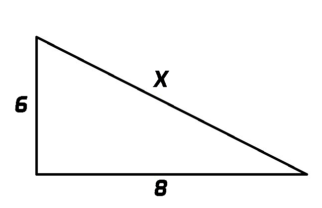
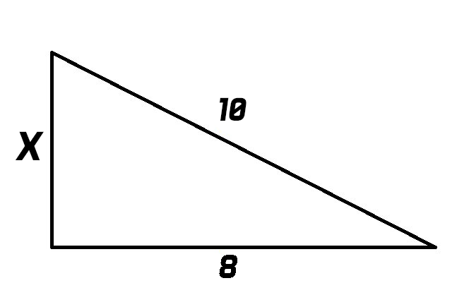

# Node Pythagorean
[](https://img.shields.io/npm/v/nodepythagorean.svg?style=flat-square)
[](https://img.shields.io/npm/dm/nodepythagorean.svg?style=flat-square)
[](https://img.shields.io/npm/dt/nodepythagorean.svg)
> In mathematics, the Pythagorean theorem, also known as Pythagoras' theorem, is a fundamental relation in Euclidean geometry among the three sides of a right triangle.

## Installation

This is a Node.js module available through the npm registry.

Before installing `nodepythagorean`, [download and install Node.js](https://nodejs.org/en/download/)

Installation is accomplished using the [npm install command](https://docs.npmjs.com/getting-started/installing-npm-packages-locally):

```bash
$ npm i nodepythagorean --save
```

## Usage

Node Pythagorean is a very simple package to use.

#### Finding The Hypotenuse

In this problem we are solving for the hypotenuse, so we use the `findHypotenuse` function that takes in two side lengths (6 and 8). 

This function returns a number which you can assign a variable name to.



```javascript
var nodepythagorean = require("nodepythagorean");

var x = nodepythagorean.findHypotenuse(6, 8));

console.log(x);

// 10
```

#### Finding A Missing Side

In this problem we are solving for x, the missing side length, so we use the `findSide` function that takes in a known side length, and the hypotenuse. **The hypotenuse should be passed into the function first.**

This function also returns a number which you can assign a variable name to.



```javascript
var nodepythagorean = require("nodepythagorean");

var x = nodepythagorean.findSide(10, 8);

console.log(x);

// 6
```